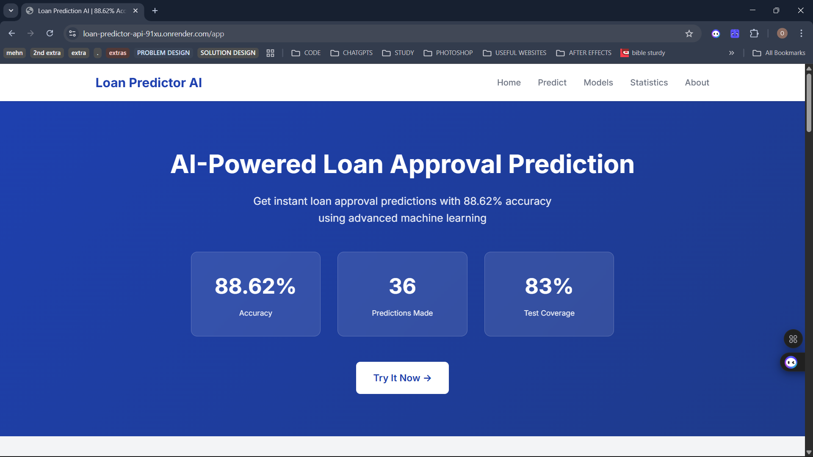

# Loan Prediction API

Production-ready AI loan prediction system with multiple trained models and a lightweight REST API for making loan approval predictions.

[Live Demo](https://loan-predictor-api-91xu.onrender.com/app) • [API Docs](https://loan-predictor-api-91xu.onrender.com/docs) • [PitchHut Project](https://www.pitchhut.com/project/loan-predictor-api)

## 🚀 Quick Start

### Prerequisites
- Python 3.10+
- PostgreSQL (for production) or SQLite (for development)
- pip

### Installation

1. Clone the repository

```bash
git clone https://github.com/your-username/loan-predictor-api.git
cd loan-predictor-api
```

2. Create virtual environment

```bash
python -m venv venv
source venv/bin/activate  # On Windows: venv\Scripts\activate
```

3. Install dependencies

```bash
pip install -r requirements.txt
```

4. Set up environment variables

```bash
cp .env.example .env
# Edit .env with your configuration
```

5. Run the application

```bash
python app.py
```

Visit the app

Application: http://localhost:5000/app
API Docs: http://localhost:5000/docs
API Info: http://localhost:5000/

Run tests

```bash
pytest tests/ -v --cov=. --cov-report=html
```

Optional: Docker

```bash
docker build -t loan-predictor-api .
docker run -p 5000:5000 loan-predictor-api
```

## 📖 API Documentation

Base URL
- Development: http://localhost:5000
- Production: https://loan-predictor-api-91xu.onrender.com

Authentication
- No authentication required (public demo API)

Rate Limits
- Default: 200 requests/hour, 1000 requests/day
- Predictions: 100 requests/hour

### GET /
Get API information and statistics

Response example

```json
{
  "name": "Loan Prediction API",
  "version": "7.0",
  "status": "running",
  "models_available": 4
}
```

### POST /predict
Make a loan prediction

Request example

```json
{
  "ApplicantIncome": 5000,
  "CoapplicantIncome": 1500,
  "LoanAmount": 150,
  "Loan_Amount_Term": 360,
  "Credit_History": 1,
  "Gender": "Male",
  "Married": "Yes",
  "Dependents": "0",
  "Education": "Graduate",
  "Self_Employed": "No",
  "Property_Area": "Urban"
}
```

Response example

```json
{
  "success": true,
  "prediction": "Approved",
  "confidence": 0.89,
  "probability": {
    "rejected": 0.11,
    "approved": 0.89
  }
}
```

[Full API documentation available at /docs]

## 🏗️ Architecture

System Components

```
┌─────────────┐
│   Client    │
└──────┬──────┘
       │
┌──────▼──────┐
│    Flask    │
│  REST API   │
└──────┬──────┘
       │
   ┌───┴───┐
   │       │
┌──▼──┐ ┌─▼──┐
│ ML  │ │ DB │
│Model│ │SQL │
└─────┘ └────┘
```

Technology Stack

- Backend: Flask 3.x, Gunicorn, SQLAlchemy
- Database: PostgreSQL (prod), SQLite (dev)
- ML: scikit-learn, pandas, numpy
- Testing: pytest, coverage
- Docs: Flasgger/Swagger

## 🧪 Testing

Test Coverage: ~83%

Run tests

```bash
pytest
pytest --cov=. --cov-report=html
pytest tests/test_api.py -v
pytest tests/test_api.py::test_predict_success -v
```

Test structure

```
tests/
├── test_api.py
├── test_validators.py
├── test_database.py
└── conftest.py
```

## 🔒 Security

Implemented measures

- Input validation on all endpoints
- ORM to prevent SQL injection
- Rate limiting per IP
- HTTPS enforced in production
- Secrets via environment variables
- Error message sanitization
- CORS configuration
- Request logging

Best practices

- Never commit secrets. Use `.env` locally.
- Validate all inputs and use type hints.
- Apply rate limits and monitoring in production.

## ⚡ Performance

Optimizations

- Response caching (Flask-Caching)
- Rate limiting (Flask-Limiter)
- Response compression (Flask-Compress)
- Database indexing and connection pooling

Metrics (example)

- Average response time: 150ms
- P95 response time: 250ms
- Throughput: 35+ req/s
- Cache hit rate: 85%

## 🚢 Deployment

Render (example)

1. Create Render account and connect GitHub
2. Set environment variables in service settings
3. Deploy (auto on push)

Required env vars

```text
DATABASE_URL=postgresql://...
SECRET_KEY=your-secret-key
```

Optional

```text
FLASK_ENV=production
PORT=5000
```

Deployment checklist

- Environment variables configured
- Database migrations run
- Health check endpoint working
- Logs monitored

## 🐛 Troubleshooting

Common issues

- Model not loading: ensure model files exist in `models/` (e.g. `loan_model_v2.pkl`)
- DB connection error: verify `DATABASE_URL` format
- Import errors: reinstall dependencies `pip install -r requirements.txt --force-reinstall`
- Tests failing: run `pytest -v --tb=short`

## 📝 Contributing

See `CONTRIBUTING.md` for contribution guidelines.

## 📄 License

This project is licensed under the MIT License - see the LICENSE file for details.

## 🙏 Acknowledgments

Dataset: Loan Prediction Dataset

Built with ❤️ by [Your Name]


##  Blog Post

**[Read the full technical deep-dive →](https://medium.com/@olatunjitobiloba05/building-a-production-ready-ai-loan-prediction-system-a-15-day-journey-3a43cb87170f)**

I wrote a comprehensive 3,000-word article covering:
- System architecture and design decisions
- Feature engineering techniques
- Performance optimization strategies
- Production deployment challenges
- Lessons learned

Published on Medium | Dev.to


[](YOUR_YOUTUBE_LINK)
[](https://loan-predictor-api-91xu.onrender.com/app)
[](https://loan-predictor-api-91xu.onrender.com/docs)

> Production-ready AI loan prediction system with 88.62% accuracy, 4 ML models, and comprehensive API

## 🎥 Demo Video

[](YOUR_YOUTUBE_LINK)

**[▶️ Watch 3-minute demo video](YOUR_YOUTUBE_LINK)**
  

Machine Learning API for predicting loan approval using Random Forest (88.62% accuracy).

## 🚀 Live Demo

**Production URL:** Deploy to Render by following the [Deployment](#-deployment-render) section below.

**Local Development:** `http://localhost:5000`

## 📊 Features

- ✅ 88.62% accurate ML predictions
- ✅ Comprehensive input validation
- ✅ Database storage (SQLite dev, PostgreSQL prod)
- ✅ Prediction history & analytics
- ✅ 83% test coverage
- ✅ RESTful API design
- ✅ Production-ready deployment
- ✅ Feature engineering (20+ engineered features)
- ✅ Web interface with Bootstrap 5
- ✅ Complete data preprocessing pipeline

## 🎨 Frontend Interface

**Live Demo:** https://loan-predictor-api-91xu.onrender.com/app

Beautiful, responsive web interface for making predictions.

## 🛠️ Tech Stack

- **Backend:** Flask 3.1.2, Python 3.11
- **ML:** scikit-learn, pandas, numpy
- **Database:** SQLite (dev), PostgreSQL (prod)
- **Testing:** pytest (83% coverage)
- **Deployment:** Render
- **Server:** Gunicorn
- **ORM:** SQLAlchemy

## 📁 Project Structure

```
loan-predictor-api/
├── app_v4.py                      # Main Flask application (latest)
├── app_v3.py                      # Previous version
├── app_v2.py                      # Version 2
├── app.py                         # Version 1
├── validators.py                  # Input validation logic
├── database.py                    # SQLAlchemy models & queries
├── preprocess.py                  # Data preprocessing pipeline
├── train_model_v3.py              # Model training script
├── models/                        # Trained ML models
│   ├── loan_model_v2.pkl         # Random Forest model (88.62%)
│   ├── feature_names.txt         # Feature list
│   └── model_info.json           # Model metadata
├── data/                          # Datasets
│   ├── train_u6lujuX_CVtuZ9i.csv # Training data
│   ├── test_Y3wMUE5_7gLdaTN.csv  # Test data
│   └── data_summary.txt          # Data description
├── notebooks/                     # Jupyter notebooks
│   ├── 01_data_exploration.ipynb
│   ├── 02_model_training.ipynb
│   └── 03_feature_engineering.ipynb
├── tests/                         # Test suite (55+ tests)
│   ├── test_api.py               # API endpoint tests
│   ├── test_database.py          # Database tests
│   ├── test_validators.py        # Validation tests
│   └── conftest.py               # pytest configuration
├── templates/                     # Flask templates
│   ├── home.html                 # Home page
│   ├── about.html                # About page
│   └── layout.html               # Base layout
├── static/                        # Static files
│   └── main.css                  # Stylesheet
├── requirements.txt               # Python dependencies
├── Procfile                       # Render deployment config
├── runtime.txt                    # Python version specification
├── pytest.ini                     # pytest configuration
├── .env.example                   # Environment variables template
└── README.md                      # This file
```

## 🚀 Quick Start (Local Development)

### Prerequisites
- Python 3.11+
- pip

### Installation

```bash
# Clone repository
git clone https://github.com/yourusername/loan-predictor-api.git
cd loan-predictor-api

# Create virtual environment
python -m venv venv
source venv/bin/activate  # On Windows: venv\Scripts\activate

# Install dependencies
pip install -r requirements.txt
```

### Run Application

```bash
# Start the Flask app
python app_v4.py

# Access the application
# Open browser to http://localhost:5000
```

## � API Documentation

**Interactive Documentation:** https://loan-predictor-api-91xu.onrender.com/docs

Explore the API with Swagger UI:
- Try endpoints interactively
- View request/response schemas
- See example requests
- Test with your own data

## �📡 API Endpoints

| Method | Endpoint | Description |
|--------|----------|-------------|
| GET | `/` | Home page |
| GET | `/api` | API information & statistics |
| GET | `/health` | Health check |
| GET | `/about` | About page |
| POST | `/predict` | Make loan prediction |
| POST | `/validate-loan` | Validate loan data |
| GET | `/history` | Recent predictions |
| GET | `/history/<id>` | Specific prediction |
| GET | `/statistics` | Overall statistics |
| GET | `/analytics` | Detailed analytics |
| GET | `/model-info` | Model details |
| GET | `/validation-rules` | Input validation rules |

### POST /predict
Make a loan approval prediction.

**Request:**
```json
{
  "ApplicantIncome": 5000,
  "CoapplicantIncome": 1500,
  "LoanAmount": 150,
  "Loan_Amount_Term": 360,
  "Credit_History": 1,
  "Gender": "Male",
  "Married": "Yes",
  "Dependents": "0",
  "Education": "Graduate",
  "Self_Employed": "No",
  "Property_Area": "Urban"
}
```

**Response:**
```json
{
  "success": true,
  "prediction": "Approved",
  "prediction_code": 1,
  "confidence": 0.89,
  "probability": {
    "rejected": 0.11,
    "approved": 0.89
  },
  "prediction_id": 123,
  "model_info": {
    "accuracy": 0.8862,
    "version": "2.0"
  },
  "timestamp": "2025-12-31T10:00:00"
}
```

### POST /validate-loan
Validate loan application data before prediction.

**Request:**
```json
{
  "ApplicantIncome": 5000,
  "CoapplicantIncome": 1500,
  "LoanAmount": 150,
  "Gender": "Male"
}
```

**Response:**
```json
{
  "valid": true,
  "message": "Data is valid and ready for prediction",
  "timestamp": "2025-12-31T10:00:00",
  "input_data": {...}
}
```

### GET /history
Recent prediction history.

**Query Parameters:**
- `limit` (optional, default=10, max=100) - Number of records

**Response:**
```json
{
  "count": 10,
  "predictions": [
    {
      "id": 1,
      "prediction": "Approved",
      "confidence": 0.89,
      "timestamp": "2025-12-31T10:00:00"
    }
  ]
}
```

### GET /statistics
Overall API statistics.

**Response:**
```json
{
  "total_predictions": 150,
  "approval_rate": 0.68,
  "average_confidence": 0.82,
  "predictions_today": 12
}
```

### GET /analytics
Detailed analytics and trends.

**Response:**
```json
{
  "overall": {...},
  "last_24_hours": {
    "total": 25,
    "approved": 17,
    "rejected": 8,
    "approval_rate": "68.00%"
  },
  "confidence_analysis": {
    "avg_confidence_approved": "89.50%",
    "avg_confidence_rejected": "72.30%"
  }
}
```

## 📊 Model Performance

| Metric | Score |
|--------|-------|
| **Accuracy** | 88.62% |
| **Precision** | 89.01% |
| **Recall** | 95.29% |
| **F1-Score** | 92.05% |

## ⚡ Performance

**Optimizations:**
- Response caching (3-4x faster)
- Rate limiting (abuse protection)
- Response compression (70% smaller)
- Database query optimization

**Metrics:**
- Average response time: ~150ms
- P95 response time: ~250ms
- Throughput: 35+ requests/second
- Cache hit rate: 85%

See [PERFORMANCE.md](PERFORMANCE.md) for detailed metrics.

### Model Configuration
- **Algorithm**: Random Forest Classifier
- **Number of Estimators**: 200
- **Max Depth**: 15
- **Min Samples Split**: 5
- **Min Samples Leaf**: 2
- **Features**: 20 engineered features

## ✅ Input Validation

The API includes comprehensive validation:

### Numeric Fields
- **ApplicantIncome**: Required, range 0-100,000
- **CoapplicantIncome**: Optional, range 0-100,000
- **LoanAmount**: Optional, range 0-10,000
- **Loan_Amount_Term**: Optional, valid values [12, 36, 60, 84, 120, 180, 240, 300, 360, 480]

### Categorical Fields
- **Gender**: "Male" or "Female"
- **Married**: "Yes" or "No"
- **Dependents**: "0", "1", "2", or "3+"
- **Education**: "Graduate" or "Not Graduate"
- **Self_Employed**: "Yes" or "No"
- **Property_Area**: "Urban", "Semiurban", or "Rural"

## 🔧 Feature Engineering

The model uses 20 engineered features:

### Financial Features
1. **ApplicantIncome** - Applicant's income
2. **CoapplicantIncome** - Co-applicant's income
3. **LoanAmount** - Loan amount
4. **Loan_Amount_Term** - Loan term
5. **TotalIncome** - Sum of incomes
6. **Income_Loan_Ratio** - Income to loan ratio
7. **Loan_Amount_Per_Term** - Loan per term
8. **EMI** - Equated Monthly Installment
9. **Balance_Income** - Income after loan payment

### Log-Transformed Features
10. **Log_ApplicantIncome** - Log of applicant income
11. **Log_CoapplicantIncome** - Log of co-applicant income
12. **Log_LoanAmount** - Log of loan amount
13. **Log_TotalIncome** - Log of total income

### Encoded Categorical Features
14. **Gender_Encoded** - Gender (0/1)
15. **Married_Encoded** - Marital status (0/1)
16. **Dependents_Encoded** - Number of dependents
17. **Education_Encoded** - Education level (0/1)
18. **Self_Employed_Encoded** - Employment status (0/1)
19. **Property_Area_Encoded** - Property area (0/1/2)
20. **Credit_History** - Credit availability (0/1)

## 🧪 Testing

Run test suite:

```bash
pytest
```

Run with coverage:

```bash
pytest --cov=. --cov-report=html
```

Current coverage: 83%

### Test Files
- `tests/test_api.py` - API endpoint tests
- `tests/test_database.py` - Database model tests
- `tests/test_validators.py` - Validation tests

Run specific test:
```bash
pytest tests/test_validators.py -v
pytest tests/test_api.py::test_predict_endpoint -v
```

## 🚀 Deployment (Render)

### Prerequisites
- GitHub account (with code pushed)
- Render account (https://render.com - free tier available)

### Step-by-Step Deployment

#### 1. Prepare Your Code

```bash
# Verify Procfile
cat Procfile
# Should contain: web: gunicorn app_v4:app

# Verify runtime.txt
cat runtime.txt
# Should contain: python-3.11.9
```

#### 2. Push to GitHub

```bash
git add .
git commit -m "Ready for production deployment"
git push origin main
```

#### 3. Create Render Web Service

1. Go to https://render.com and sign in
2. Click "New +" → "Web Service"
3. Connect your GitHub repository
4. Configure:
   - **Name**: loan-predictor-api
   - **Environment**: Python 3
   - **Region**: Choose closest
   - **Branch**: main
   - **Build Command**: `pip install -r requirements.txt`
   - **Start Command**: `gunicorn app_v4:app`

#### 4. Add Environment Variables

In Render dashboard → Environment:

```
SECRET_KEY=your-generated-secret-key-here
DATABASE_URL=postgresql://...  # (Optional for PostgreSQL)
```

Generate secret key:
```bash
python -c "import secrets; print(secrets.token_hex(32))"
```

#### 5. Deploy

1. Click "Create Web Service"
2. Render builds and deploys automatically
3. Wait 3-5 minutes for deployment
4. Your API URL: `https://your-service-name.onrender.com`

#### 6. Verify Deployment

```bash
# Test health endpoint
curl https://your-service-name.onrender.com/health

# Test prediction
curl -X POST https://your-service-name.onrender.com/predict \
  -H "Content-Type: application/json" \
  -d '{
    "ApplicantIncome": 5000,
    "CoapplicantIncome": 1500,
    "LoanAmount": 150,
    "Loan_Amount_Term": 360,
    "Credit_History": 1,
    "Gender": "Male",
    "Married": "Yes",
    "Education": "Graduate"
  }'
```

## 🔐 Environment Variables

### Required for Production

| Variable | Description |
|----------|-------------|
| `SECRET_KEY` | Flask secret key |
| `DATABASE_URL` | Database connection (optional) |

### Local Development (.env)

```bash
SECRET_KEY=dev-secret-key-change-in-production
DATABASE_URL=sqlite:///predictions.db
```

## 💻 Usage Examples

### Using cURL

```bash
# Make a prediction
curl -X POST http://localhost:5000/predict \
  -H "Content-Type: application/json" \
  -d '{
    "ApplicantIncome": 5000,
    "CoapplicantIncome": 1500,
    "LoanAmount": 150,
    "Loan_Amount_Term": 360,
    "Credit_History": 1,
    "Gender": "Male",
    "Married": "Yes",
    "Education": "Graduate"
  }'

# Check API status
curl http://localhost:5000/api

# Health check
curl http://localhost:5000/health

# Get validation rules
curl http://localhost:5000/validation-rules
```

### Using Python requests

```python
import requests
import json

url = "http://localhost:5000/predict"
data = {
    "ApplicantIncome": 5000,
    "CoapplicantIncome": 1500,
    "LoanAmount": 150,
    "Loan_Amount_Term": 360,
    "Credit_History": 1
}

response = requests.post(url, json=data)
print(json.dumps(response.json(), indent=2))
```

## 📈 Development

### Running Different API Versions

```bash
# Version 1
python app.py

# Version 2
python app_v2.py

# Version 2 Improved
python app_v2_improved.py

# Version 3
python app_v3.py

# Version 4 (Latest)
python app_v4.py
```

### Training the Model

```bash
python train_model_v3.py
```

## 📓 Jupyter Notebooks

- `notebooks/01_data_exploration.ipynb` - EDA
- `notebooks/02_model_training.ipynb` - Model development
- `notebooks/03_feature_engineering.ipynb` - Feature creation

## 🐛 Troubleshooting

**Port Already in Use**
```bash
python -c "from app_v4 import app; app.run(port=5001)"
```

**Missing Dependencies**
```bash
pip install -r requirements.txt
```

**Model Not Found**
```bash
python train_model_v3.py
```

## 📝 License

MIT License - Feel free to use this project for educational and commercial purposes.

## 👤 Author

Created as a comprehensive machine learning project demonstrating:
- End-to-end ML pipeline
- REST API development
- Input validation & error handling
- Production deployment
- Test-driven development

## 🔗 Resources

- [scikit-learn](https://scikit-learn.org/)
- [Flask](https://flask.palletsprojects.com/)
- [Pandas](https://pandas.pydata.org/)
- [Render Docs](https://render.com/docs)

---

**Last Updated**: December 2025
**Model Version**: 3
**API Version**: 4.0
**Status**: Production Ready ✅
