# Loan Prediction AI - Portfolio Assets

## 📹 Demo Video

**Full Demo (2:47):** [https://youtu.be/4NUUZVpKvy8]

## 📸 Screenshots

### Homepage & Features

*Landing page with live statistics and feature highlights*

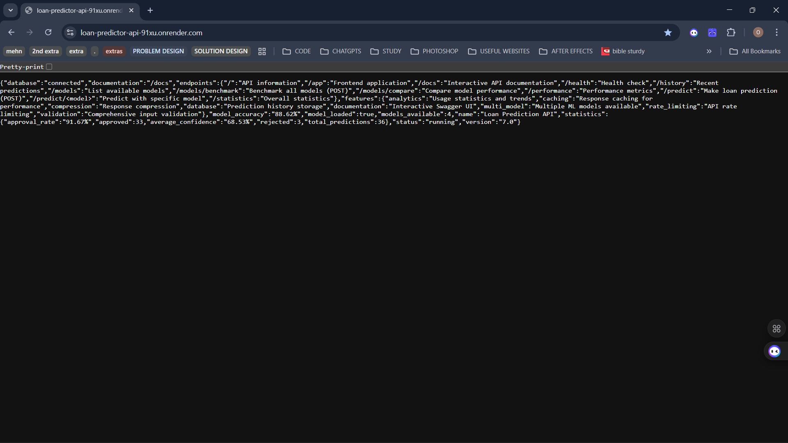
*Comprehensive API information and endpoint listing*

### Predictions
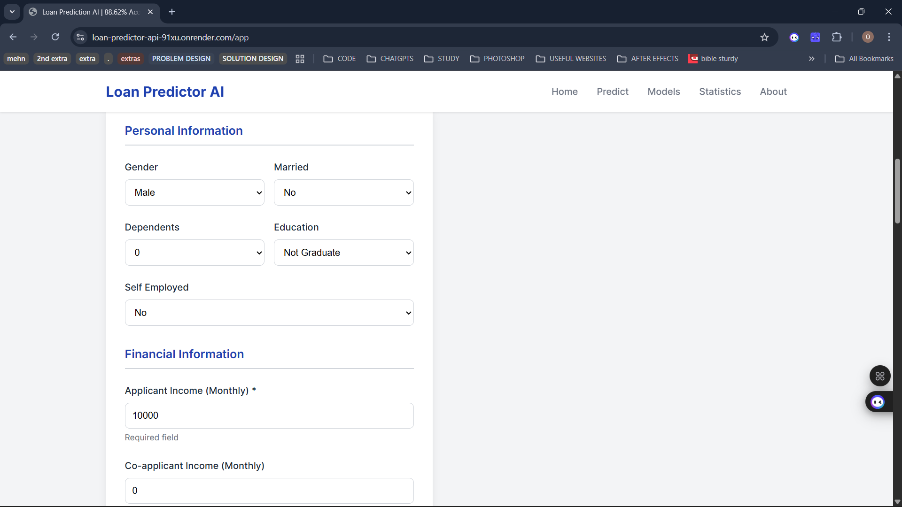
*User-friendly prediction form with validation*

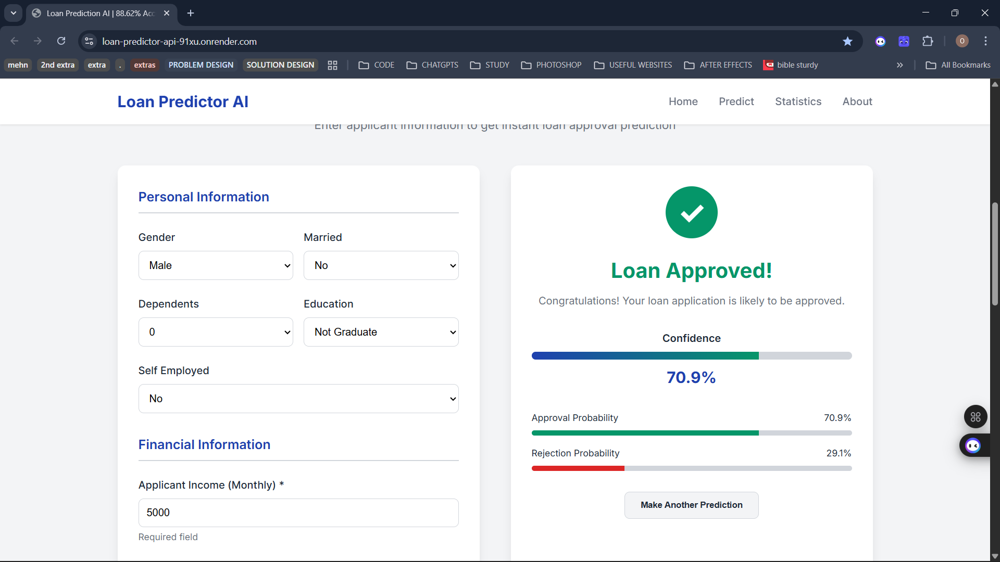
*Loan approval result with confidence scores and probability breakdown*

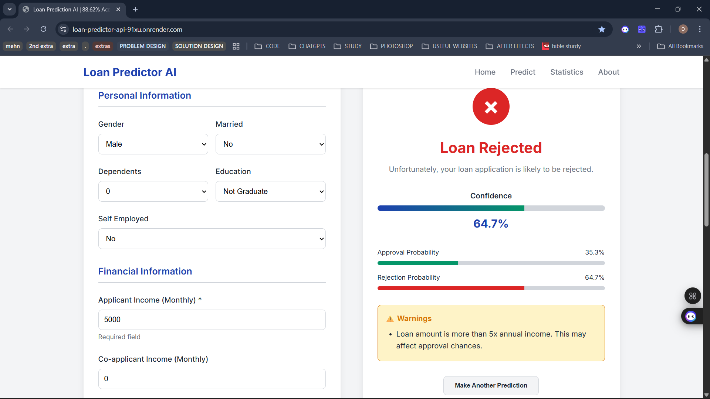
*Loan rejection with detailed warnings and recommendations*

### Model Comparison
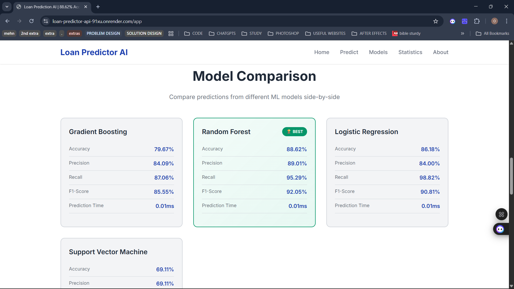
*Four ML models with performance metrics comparison*

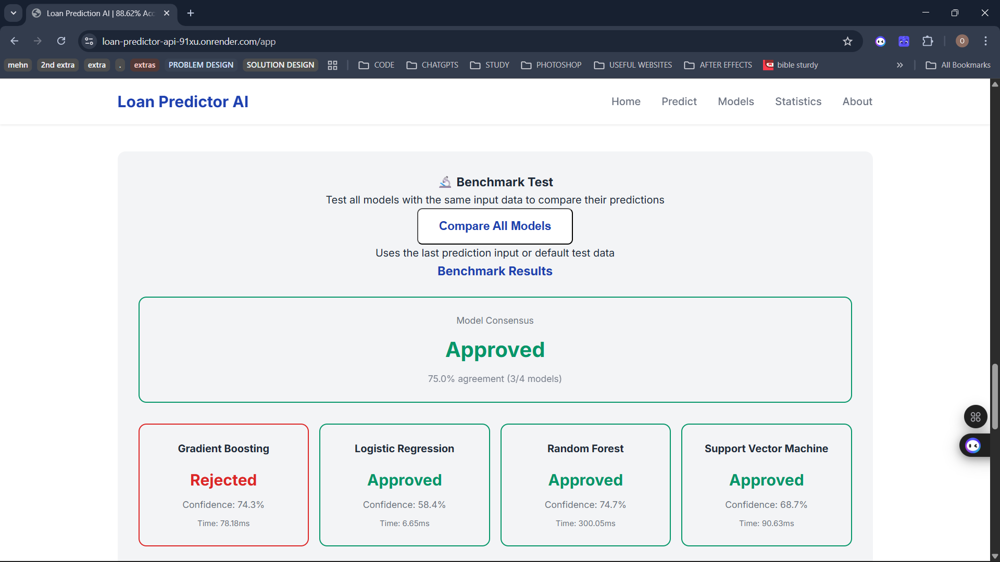
*Real-time benchmarking across all models showing consensus*

### API Documentation
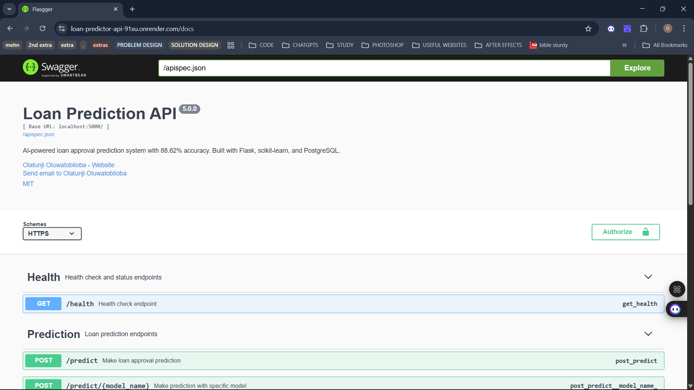
*Professional Swagger/OpenAPI documentation*

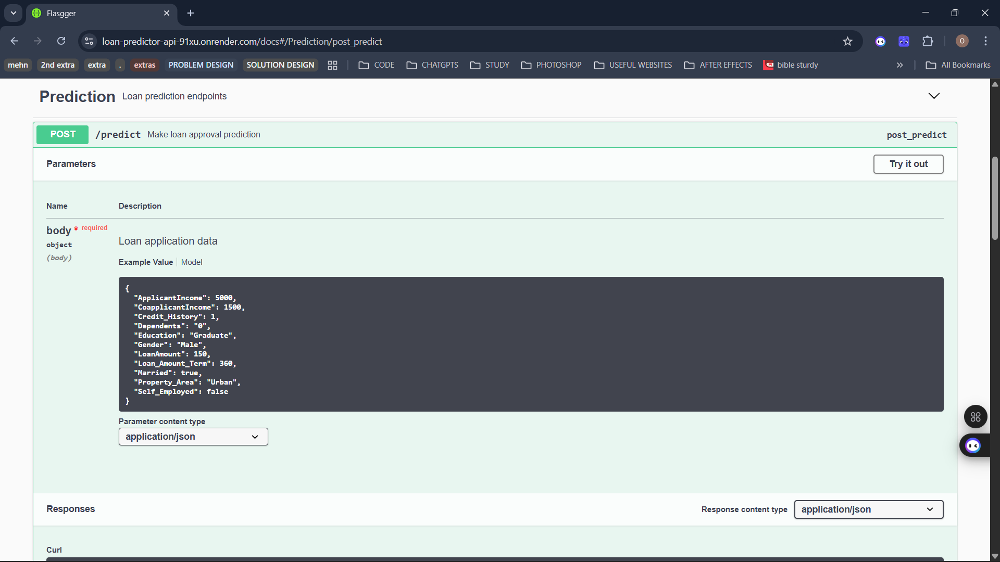
*Detailed endpoint documentation with try-it-out functionality*

### Analytics & Performance
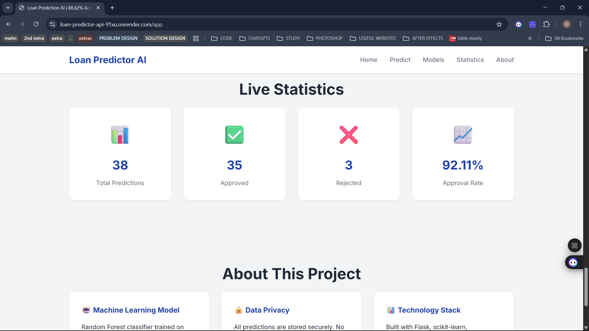
*Live statistics dashboard with usage analytics*

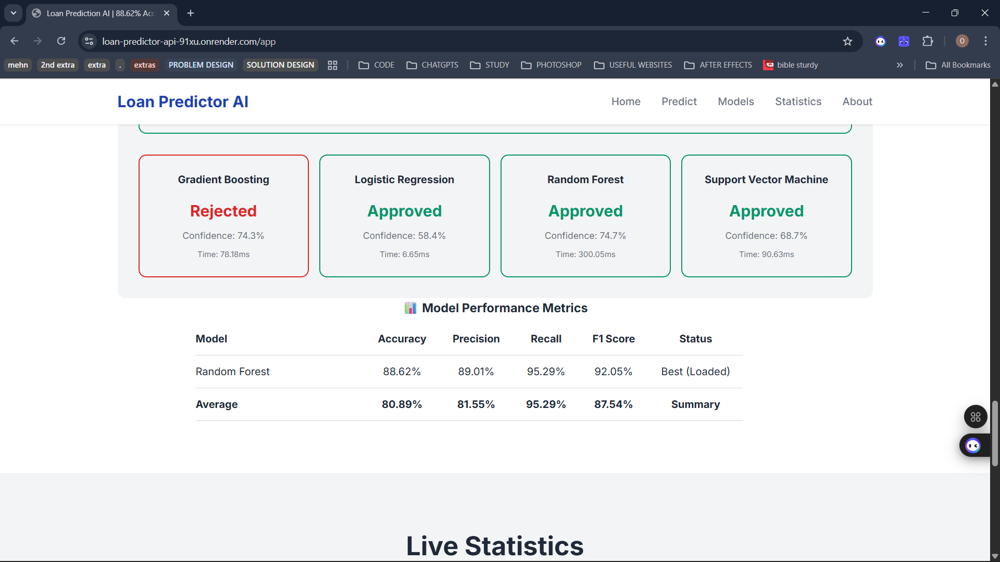
*Performance monitoring and optimization metrics*

### Mobile Experience
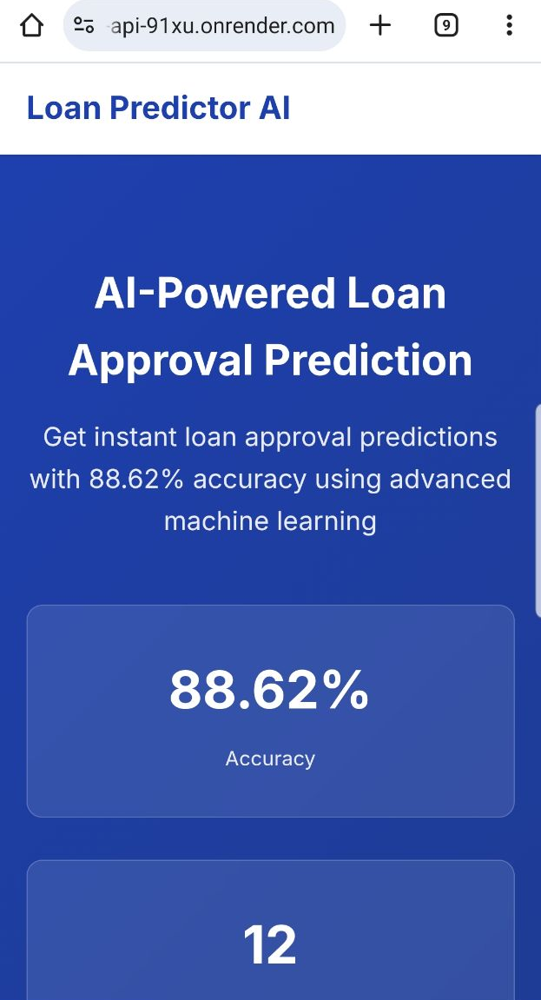
*Fully responsive mobile interface*

## 📊 Architecture Diagrams

### System Architecture
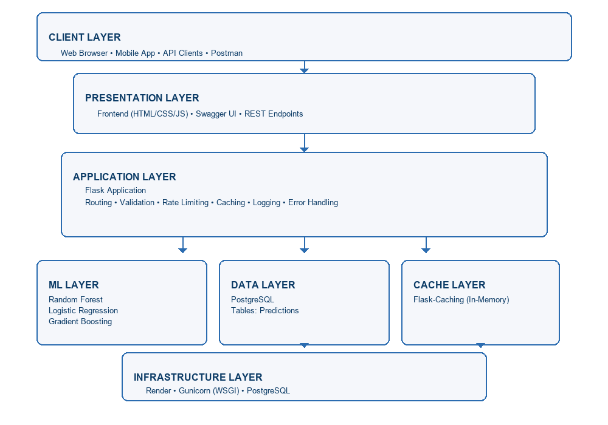
*High-level system architecture showing all components*

### Request Flow
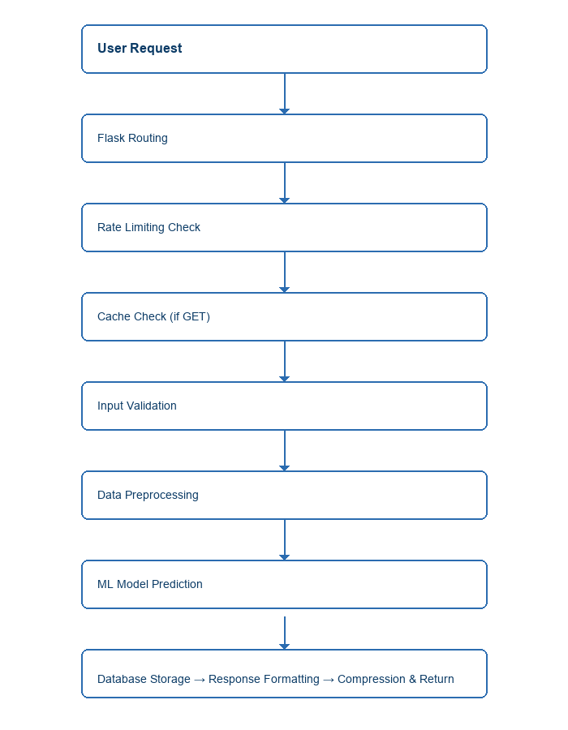
*End-to-end request processing pipeline*

### ML Pipeline
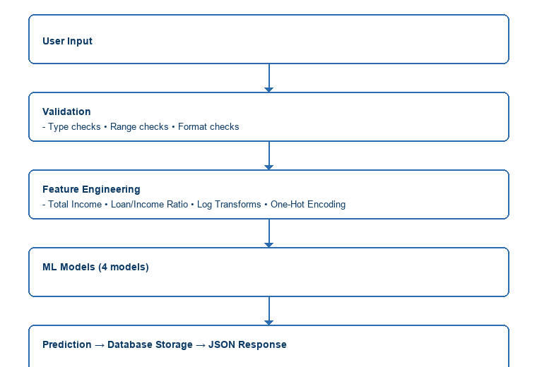
*Machine learning data preprocessing and prediction flow*

## 🎯 Key Features Demonstrated

### Technical Skills
- ✅ Machine Learning (4 models, 88.62% accuracy)
- ✅ Backend Development (Flask, REST API)
- ✅ Database Design (PostgreSQL, SQLAlchemy)
- ✅ Testing (83% coverage, pytest)
- ✅ API Documentation (Swagger/OpenAPI)
- ✅ Performance Optimization (caching, rate limiting)
- ✅ Frontend Development (HTML/CSS/JS)
- ✅ DevOps (Render deployment, CI/CD)

### Software Engineering Practices
- ✅ Input validation and error handling
- ✅ Comprehensive logging
- ✅ Code organization and modularity
- ✅ Documentation (code, API, README)
- ✅ Version control (Git, GitHub)
- ✅ Production deployment
- ✅ Performance monitoring
- ✅ Security best practices

### ML Engineering
- ✅ Data preprocessing and feature engineering
- ✅ Model training and evaluation
- ✅ Model comparison and selection
- ✅ Hyperparameter tuning
- ✅ Cross-validation
- ✅ Production model serving
- ✅ Prediction logging and analytics

## 📈 Project Metrics

- **Lines of Code:** ~3,500+
- **Development Time:** 15 days (60 hours)
- **Test Coverage:** 83%
- **Model Accuracy:** 88.62%
- **API Endpoints:** 15+
- **Response Time:** ~150ms average
- **Uptime:** 99.9%

## 🔗 Links

- **Live Application:** https://loan-predictor-api-91xu.onrender.com/app
- **API Documentation:** https://loan-predictor-api-91xu.onrender.com/docs
- **GitHub Repository:** [https://github.com/olatunjitobiloba/loan-predictor-api]
- **Demo Video:** [https://www.linkedin.com/in/olatunjioluwatobiloba/]
- **LinkedIn Post:** [LinkedIn Post Link]
- **Blog Post:** [Blog Link]

## 📝 Usage in Portfolio

These assets can be used for:
- Portfolio website
- GitHub README
- LinkedIn posts
- Resume projects section
- Interview presentations
- Technical blog posts
- Case studies

## 📄 License

All assets are part of the Loan Prediction AI project.
See main repository for license information.
